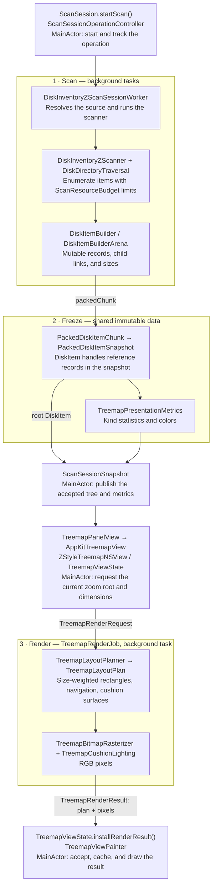

# Architecture

Disk Hog separates filesystem acquisition, immutable scan data, and presentation.
The diagram follows a scan from the UI to filesystem traversal, packed data,
and the rendered treemap. Each box names the implementation to look for below.

`ScanSessionOperationController` rejects obsolete scan callbacks;
`TreemapViewState` cancels superseded rendering and installs only the current
request. Zooming and resizing repeat the rendering stage using the existing
snapshot; they do not rescan the filesystem.

## Architectural style: MVVM with AppKit integration

Disk Hog uses an **MVVM-style presentation layer**, AppKit window controllers,
and separate scanning/storage/rendering services. This describes the code's
responsibilities rather than a formally enforced architecture framework:

- **Models:** `DiskItem`, `PackedDiskItemSnapshot`, and `ScanSessionSnapshot`
  represent the scanned tree and accepted session data.
- **View models:**
  [`SourceWindowViewModel`](disk_hog/Views/SourceWindow/SourceWindowViewModel.swift)
  exposes source-selection state and actions. `ScanSession` plays the equivalent
  role for scan windows: it publishes UI state and exposes commands while
  delegating operations to workers/controllers.
- **Views and adapters:** `SourceWindowView`, `ScanWindowView`, and
  `TreemapPanelView` declare the SwiftUI interface. `AppKitTreemapView` bridges
  the native treemap through `NSViewRepresentable`; AppKit window controllers
  manage window lifecycles.

## How state reaches the UI

The primary mechanism is **Combine observation through SwiftUI**, using
`ObservableObject` and `@Published`. The app does not currently use the newer
Observation framework's `@Observable` macro.

[`ScanWindowView`](disk_hog/Views/ScanWindowView.swift) retains its session and
selection/navigation objects with `@StateObject`; child views such as
`TreemapPanelView` subscribe with `@ObservedObject`. When `ScanSession` updates
its `@Published` snapshot or activity on `@MainActor`, Combine emits
`objectWillChange`, and SwiftUI reevaluates dependent view bodies and reconciles
the UI. Local state uses `@State`; `Binding` values, including bindings passed
through the environment, connect hover, pane, and selection interactions.

[`AppKitTreemapView`](disk_hog/Views/ScanWindow/TreemapPanel/AppKitTreemapView.swift)
forwards current inputs through `updateNSView`. Its `Coordinator.observeSelection`
also uses `selectionCoordinator.$selectedItem.sink` to update native selection
directly. Native callbacks send user actions back to the shared state objects.

`async`/`await`, detached `Task`s, cancellation, and operation/request identity
checks keep expensive work off the main actor and prevent obsolete results from
replacing current state. These coordinate work; publication drives observation.
For consumers that need the already-updated tree, `ScanSession.publish` assigns
the snapshot before posting `scanSessionTreeDidChange` through
[`NotificationCenter`](disk_hog/Support/Notifications/ScanSessionNotifications.swift).
That explicit post-change event supplements Combine's pre-change notification.

## Application and session ownership

[`DiskHogApp` and `DiskHogApplicationDelegate`](disk_hog/disk_hogApp.swift)
connect SwiftUI commands to AppKit windows and Full Disk Access setup.
[`SourceWindowController` and `ScanWindowController`](disk_hog/Support/Windows/ManagedWindowControllers.swift)
manage source selection and scan windows. Each scan window has a
[`ScanSession`](disk_hog/Models/ScanSessions/ScanSession.swift), the `MainActor`
observable interface used by views and commands.

`ScanSession` delegates background operations, cancellation, and stale-callback
rejection to
[`ScanSessionOperationController`](disk_hog/Models/ScanSessions/ScanSessionOperationController.swift).
Accepted results become a
[`ScanSessionSnapshot`](disk_hog/Models/ScanSessions/ScanSessionSnapshot.swift)
containing the root, selection, counts, skipped items, and presentation metrics.
[`ScanSessionPresentationController`](disk_hog/Models/ScanSessions/ScanSessionPresentationController.swift)
coordinates derived presentation changes. See the
[session ownership notes](disk_hog/Models/ScanSessions/README.md) for publication
and concurrency details.

## Scanning filesystem items

[`DiskInventoryZScanSessionWorker.scan`](disk_hog/Models/ScanSessions/ScanSessionScanWorker.swift)
resolves the source bookmark, invokes the scanner, and prepares kind/color
metrics. The operation controller runs this work in a detached task.

[`DiskInventoryZScanner.scan`](disk_hog/Scanner/DiskInventoryZScanner.swift)
opens security-scoped access and enumerates the root's immediate children.
It submits those subtrees to a bounded task group;
[`ScanResourceBudget`](disk_hog/Scanner/ScanResourceBudget.swift) limits concurrent
filesystem traversals across scans.

Within each subtree,
[`DiskDirectoryTraversal.loadChildren`](disk_hog/Scanner/DiskDirectoryTraversal.swift)
uses `FileManager.DirectoryEnumerator` and an explicit parent stack to construct
the hierarchy. [`DiskItemBuilderFactory`](disk_hog/Scanner/DiskItemBuilderFactory.swift)
turns resource metadata into items with both allocated and logical byte counts.
Traversal handles packages according to `DiskScanSettings`, avoids descending
into nested volumes, applies `HardlinkDeduplicator`, checks cancellation, and
reports progress. Unreadable entries become `ScanSkippedItem` records; failure
to enumerate the scan root fails the scan. Folder sizes are accumulated with
`DiskItemBuilder.recalculateSize`.

## Storing the scanned tree

During traversal, [`DiskItemBuilder`](disk_hog/Models/DiskItems/DiskItemBuilder.swift)
is a handle into a mutable `DiskItemBuilderArena`, which stores records and child
relationships. Each top-level subtree owns its arena.

[`DiskItemBuilder.packedChunk`](disk_hog/Models/DiskItems/DiskItemBuilderFreezing.swift)
freezes a completed subtree into a
[`PackedDiskItemChunk`](disk_hog/Models/DiskItems/PackedDiskItemStorage.swift):
record arrays hold sizes, flags, and counts; a child-index array holds hierarchy;
a UTF-8 byte buffer holds strings. The scanner releases completed builders and
assembles their chunks into a `PackedDiskItemSnapshot` through `DiskItem.chunkedRoot`.

[`DiskItem`](disk_hog/Models/DiskItems/DiskItem.swift) is an immutable handle pairing
that shared snapshot with a `PackedDiskItemAddress`. Child handles and decoded
metadata are produced on demand. This is an in-memory snapshot, not a persistent
filesystem database or a live monitor.
[`DiskItemTreeEditor`](disk_hog/Models/DiskItems/DiskItemTreeEditor.swift) creates
replacement snapshots for subtree updates and deletions, sharing unaffected
packed storage where possible. Re-scan acquires fresh filesystem state.

## Building and displaying treemaps

1. **Prepare colors and statistics.**
   [`TreemapPresentationMetrics`](disk_hog/Treemap/TreemapPresentationMetrics.swift)
   aggregates file kinds and assigns colors. It does not calculate window-sized
   rectangles.
2. **Request a render.**
   [`TreemapPanelView`](disk_hog/Views/ScanWindow/TreemapPanel/TreemapPanelView.swift)
   passes the zoom root through `AppKitTreemapView` to `ZStyleTreemapNSView`.
   [`TreemapViewState.startRender`](disk_hog/Views/ScanWindow/TreemapPanel/TreemapViewState.swift)
   launches a detached `TreemapRenderJob` with dimensions, scale, size mode,
   colors, and optional free/other-space items.
3. **Lay out rectangles.**
   [`TreemapLayoutPlanner.makePlanCheckingCancellation`](disk_hog/Treemap/TreemapLayoutPlanner.swift)
   recursively partitions each folder into rows weighted by allocated or logical
   size. Packages and folders too small to subdivide become aggregate regions.
   Its `TreemapLayoutPlan` contains item rectangles, hit/navigation indexes, and
   cushion surfaces for shading.
4. **Rasterize and install.**
   [`TreemapRenderJob`](disk_hog/Treemap/TreemapRenderJob.swift) passes those surfaces
   to [`TreemapBitmapRasterizer`](disk_hog/Treemap/TreemapBitmapRasterizer.swift),
   which produces RGB pixels using `TreemapCushionLighting`.
   `TreemapViewState.installRenderResult` accepts only the current request,
   creates an `NSBitmapImageRep` on the main actor, and caches the result.
   [`TreemapViewPainter`](disk_hog/Views/ScanWindow/TreemapPanel/TreemapViewPainter.swift)
   draws the bitmap and selection overlays. Selection and hit testing reuse the
   layout; they do not require rescanning the filesystem.
